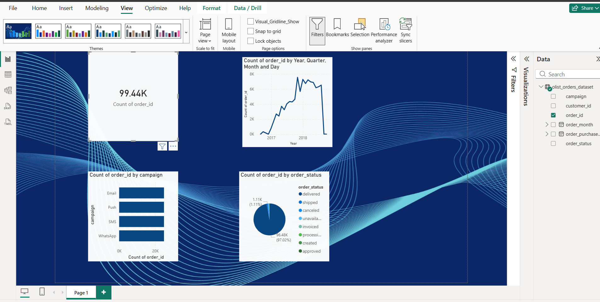

# CRM Campaign Dashboard (Power BI + SQL)

## Tools Used
- Power BI
- MySQL
- Excel

## Description
This project analyzes customer orders and marketing campaigns.
It shows:
- Total number of orders
- Orders by campaign (Email, SMS, Push, WhatsApp)
- Order status distribution
- Monthly order trend

## SQL Queries
All business logic is written in `queries.sql`.

## Dashboard Preview

## Skills Demonstrated
- SQL Aggregations (COUNT, GROUP BY)
- Data modeling
- Power BI visuals
- Business insights
